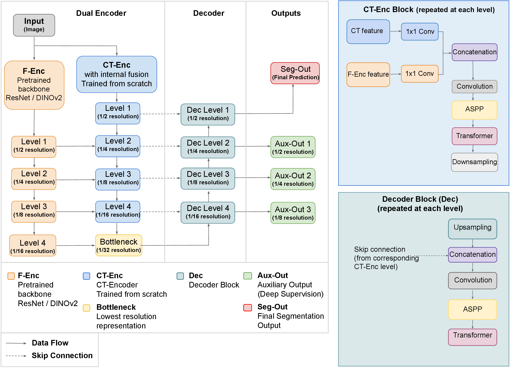

# FTSpec-UNet

Configurations for **FTSpec-UNet**, a dual-encoder segmentation network for the intraoperative identification of anatomical structures in video-assisted thoracoscopic surgery (VATS).

FTSpec-UNet combines a pretrained **Foundation Encoder** (ResNet or DINOv2) with a **task-specific CT-Encoder** trained from scratch. This decouples pretraining from network configuration, so the task-specific branch can be reconfigured for a new procedure without repeating large-scale pretraining.

> **Note:** This repository accompanies the paper published at the **MICCAI AMAI Workshop 2026**. It is provided to document the full training configuration.

📄 **Paper:** [https://papers.miccai.org/miccai-2026-sat/AMAI_043.html](https://papers.miccai.org/miccai-2026-sat/AMAI_043.html)

## Architecture

  

[Vector version (PDF)](images/Architecture_fig.pdf)

---

## Contents

For further information please contact: dennis.barnes@uibk.ac.at
